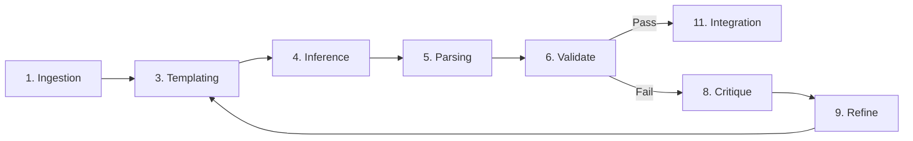

# Prompt Orchestration Pipeline (POP)

**A local-first, process-isolated framework for building reliable, autonomous AI agents.**

This system allows engineers to compose complex chains of LLM tasks into resilient pipelines. Instead of relying on fragile "mega-prompts" or black-box scripts, POP decomposes work into standardized stages, enforcing quality through autonomous critique loops and robust architecture.

---

## Documentation

- **[Architecture Deep-Dive](docs/current-architecture.md)**: Detailed breakdown of the orchestrator, runner, and state management.
- **[Task Development Guide](docs/pop-task-guide.md)**: How to build valid pipeline tasks using the 11-stage lifecycle.
- **[LLM Provider Requirements](docs/provider-requirements.md)**: Standards for implementing new model providers.
- **[Feature Audit](docs/feature-audit.md)**: Comprehensive list of current system capabilities.
- **[Jobs to be Done (JTBD)](docs/jtbd.md)**: User motivations and desired outcomes for the framework.

---

## What It Does (and Why It Matters)

This framework is designed for AI Engineers and Systems Integrators who need to move beyond simple chatbots to build reliable, multi-step workflows.

### 1. Orchestrate Reliable, Multi-Stage Workflows
Running long-duration AI tasks locally can be fragile. A single script crash or API timeout can waste hours of execution and dollars in token costs.
*   **Process Isolation**: Every pipeline runs in its own dedicated child process. If one agent crashes, your orchestrator stays alive.
*   **Resumability**: Pause, stop, and resume jobs from any specific task. Fix a bug in step 5 and restart exactly where you left off.
*   **Atomic State**: Every stage transition is saved to disk instantly. You never lose progress.

### 2. Gain Radical Observability
"Black box" agents are impossible to debug. POP provides deep visibility into the "thought process" of your pipelines.
*   **Real-Time Dashboard**: Watch jobs progress stage-by-stage via a built-in UI (Server-Sent Events).
*   **Granular Logging**: Every input, output, and internal thought is captured in dedicated log files.
*   **Cost Tracking**: See exact token usage and cost breakdown for every task and model call.

### 3. Enforce Quality Autonomously
LLMs are probabilistic and prone to errors. POP enforces a rigid **11-stage lifecycle** for every task to catch mistakes before they propagate.
*   **Standardized Flow**: `Ingestion` → `Inference` → `Validation` → `Critique` → `Refinement`.
*   **Self-Correction**: Configurable loops allow the system to detect invalid outputs, critique itself, and refine the answer automatically.
*   **Structured Output**: Built-in validators ensuring JSON schema compliance.

### 4. Avoid Vendor Lock-In
Switch models globally or per-task without rewriting your logic.
*   **Supported Providers**:
    *   **OpenAI** (GPT-4, GPT-4o)
    *   **Anthropic** (Claude 3.5 Sonnet, Haiku, Opus)
    *   **DeepSeek** (V3, R1)
    *   **Google Gemini** (Pro, Flash)
    *   **Moonshot** (Kimi)
    *   **Zhipu** (GLM-4)
    *   **Claude Code** (CLI integration)

---

## System Architecture

The system follows a "Watch Folder" architectural pattern, designed for simplicity and ease of integration.

### Level 1: System Context
The **Prompt Orchestration Pipeline** sits between your external triggers (users, scripts, cron jobs) and the LLM Providers.

*   **Input**: A JSON "seed" file dropped into a watched folder.
*   **Processing**: The system orchestrates the flow of data through defined tasks.
*   **Output**: Completed artifacts and logs written to disk.

### Level 2: Containers
The system comprises three main runtime containers:

1.  **Orchestrator (Daemon)**
    *   **Role**: The long-running supervisor.
    *   **Responsibility**: Watches the `pipeline-data/pending/` directory. When a file appears, it initializes the job and spawns a Runner.
2.  **Pipeline Runner (Process)**
    *   **Role**: An ephemeral, isolated worker.
    *   **Responsibility**: Loads the specific pipeline configuration (e.g., "Content Gen") and executes the sequence of tasks.
3.  **UI Server (Optional)**
    *   **Role**: Observability layer.
    *   **Responsibility**: Reads state files and pushes real-time updates to the web dashboard via SSE.

### Level 3: Components
Inside the **Pipeline Runner**, the logic is structured into:

*   **Task Runner**: The engine that drives a specific task (e.g., "Research") through the standardized lifecycle.
*   **LLM Layer**: A unified abstraction for all model providers, handling retries, cost calculation, and normalization.
*   **Symlink Bridge**: A specialized component that ensures every task has deterministic access to `node_modules` and shared utilities, regardless of where it is defined on disk.
*   **Status Writer**: An atomic file-writer that updates `tasks-status.json` safely, preventing data corruption.

### Level 4: Code (The Task Lifecycle)
Every task implementation enforces a strict 11-stage flow to ensure consistency:



*(Note: PreProcessing, ValidateQuality, and FinalValidation stages are also available but optional)*

---

## Getting Started

### 1. Install
Add the orchestrator as a dependency in your Node.js project:
```bash
npm install @ryan-fw/prompt-orchestration-pipeline
```

### 2. Initialize Structure
Scaffold the required `pipeline-config` and `pipeline-data` directories:
```bash
npx pipeline-orchestrator init --root ./pipelines
```

### 3. Configure Scripts
Add the following to your `package.json` for easy access:
```json
{
  "scripts": {
    "pipeline": "npx pipeline-orchestrator start --root pipelines --port 3010"
  }
}
```

### 4. Start the System
```bash
npm run pipeline
```
This starts the file watcher and the web dashboard at `http://localhost:3010`.

### 5. Run a Job
Drop a JSON file into `pipelines/pipeline-data/pending/`:
```json
{
  "name": "my-first-run",
  "pipeline": "default",
  "data": { "topic": "AI Architecture" }
}
```

The Orchestrator will pick it up, move it to `current/`, and start processing.