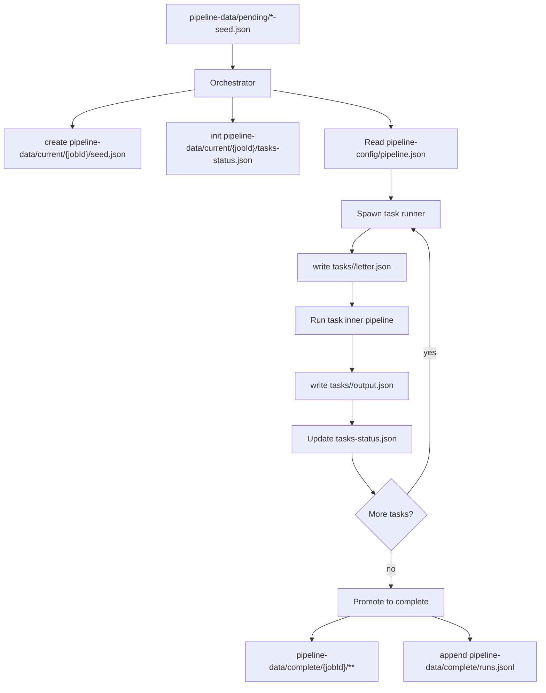
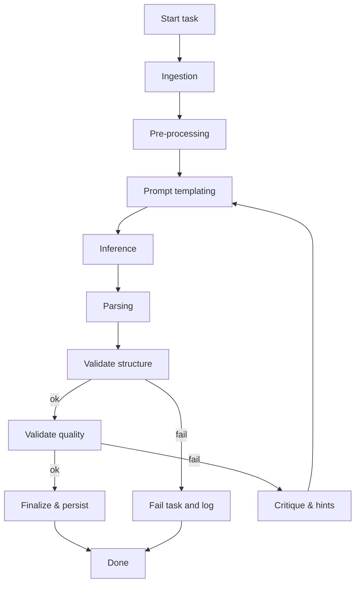

# Pipeline Orchestrator (Prompt‑Orchestration Pipeline)

A **Prompt‑orchestration pipeline (POP)** is a framework for building, running, and experimenting with complex chains of LLM tasks.

Instead of relying on a single mega‑prompt, a pipeline decomposes work into stages, applies targeted transformations, validates outputs, and composes multiple model calls into a repeatable workflow.

This repository provides a reference implementation of a prompt‑orchestration pipeline that can be consumed as an npm package by other Node.js projects. It is intentionally lightweight: just enough orchestration to run complex pipelines, inspect intermediate artifacts, and evolve new strategies.

---

## Why it matters

Single‑prompt strategies are fragile:

- Inputs must fit within a single context window.
- Instructions and examples compete for limited space.
- Quality control is all‑or‑nothing.

A prompt‑orchestration pipeline changes the game:

- **Chained reasoning** – break down complex problems into sequential tasks.
- **Context compression & stacking** – condense outputs into artifacts that feed the next stage.
- **Multi‑model strategies** – route subtasks to the most appropriate model (fast vs. large, cheap vs. accurate).
- **Validation loops** – enforce structure, apply quality checks, and retry when needed.
- **Experimentation** – swap tasks in and out to try new ideas without rewriting the whole system.

The result: workflows that are **more robust, interpretable, and capable** than any single prompt.

---

## Architecture (conceptual)

A prompt‑orchestration pipeline has **two layers**:

### 1) Pipeline orchestration (outer layer)

The outer pipeline manages runs, state, and isolation. It is responsible for:

- Assigning a pipeline run ID for each new submission.
- Creating predictable directories for pending seeds, active runs, and completed runs.
- Spawning isolated processes for each task (so one failure doesn't crash others).
- Tracking progress in a run‑scoped status file.
- Promoting completed runs into a repository of results with audit metadata.

**Runtime directories (in the consuming project):**

```
my-project/
└── pipeline-data/
    ├── pending/           # queue seeds here (e.g., *.json)
    ├── current/           # active run state (auto‑managed)
    └── complete/          # archived runs (auto‑managed)
```

**High‑level flow**



### 2) Task orchestration (inner layer)

Each pipeline step runs through a **task runner** that executes canonical sub‑steps:

1. **Ingestion** – retrieve existing data or context.
2. **Pre‑processing** – compress or transform input to fit model constraints.
3. **Prompt templating** – assemble the instruction.
4. **Inference** – run the model call(s).
5. **Parsing** – normalize outputs into structured form.
6. **Validation** – check schema, quality, and semantic correctness.
7. **Critique & refinement** – generate hints, re‑prompt, and retry if needed.
8. **Finalization** – confirm valid output and persist artifacts.



---

## Section A — Library (this package)

### Repository layout

```
@ryan-fw/prompt-orchestration-pipeline/
├── src/
│   ├── core/
│   │   ├── task-runner.js         # Core pipeline execution
│   │   ├── pipeline-runner.js     # Pipeline management
│   │   └── orchestrator.js        # Workflow orchestration
│   ├── cli/
│   │   └── index.js               # CLI entry point
│   ├── api/
│   │   └── index.js               # Programmatic API
│   └── ui/
│       └── server.js              # Optional UI server
├── bin/
│   └── pipeline-orchestrator      # CLI executable
├── package.json
└── README.md
```

### Package exports & CLI

```json
{
  "name": "@ryan-fw/prompt-orchestration-pipeline",
  "version": "1.0.0",
  "type": "module",
  "exports": {
    ".": "./src/api/index.js",
    "./cli": "./src/cli/index.js",
    "./runner": "./src/core/task-runner.js"
  },
  "bin": {
    "pipeline-orchestrator": "./bin/pipeline-orchestrator"
  },
  "dependencies": {
    "chokidar": "^3.5.3",
    "commander": "^11.0.0",
    "express": "^4.18.0"
  }
}
```

- **CLI name:** `pipeline-orchestrator`
- **Programmatic API:** import from `@ryan-fw/prompt-orchestration-pipeline` (see `src/api/index.js`).
- **Task runner (advanced):** `@ryan-fw/prompt-orchestration-pipeline/runner`.

---

## Section B — Consuming project usage

### Expected layout in a consumer project

```
my-project/
├── pipeline-config/
│   ├── registry.json              # Pipeline registry (maps slugs → configurations)
│   └── pipelines/                 # Pipeline definitions (slugged layout)
│       ├── content/
│       │   ├── pipeline.json      # Pipeline definition (ordered list of task IDs)
│       │   └── tasks/             # Task implementations
│       │       ├── index.js       # Task registry (maps task IDs → modules)
│       │       ├── task-a/
│       │       │   └── index.js
│       │       └── task-b/
│       │           └── index.js
│       └── analytics/             # Additional pipeline (example)
│           ├── pipeline.json
│           └── tasks/
│               └── index.js
├── pipeline-data/                 # Runtime directories (auto‑created/managed)
│   ├── pending/
│   ├── current/
│   └── complete/
├── package.json
└── .pipelinerc.json              # Optional CLI config
```

**`pipeline-config/registry.json` (example)**

```json
{
  "pipelines": {
    "content": {
      "name": "Content Generation Pipeline",
      "description": "Generates and processes content using LLM tasks",
      "pipelinePath": "pipeline-config/content/pipeline.json",
      "taskRegistryPath": "pipeline-config/content/tasks/index.js"
    },
    "analytics": {
      "name": "Analytics Pipeline",
      "description": "Processes data for analytics and reporting",
      "pipelinePath": "pipeline-config/analytics/pipeline.json",
      "taskRegistryPath": "pipeline-config/analytics/tasks/index.js"
    }
  }
}
```

**`pipeline-config/pipelines/content/pipeline.json` (example)**

```json
{
  "tasks": ["task-a", "task-b"]
}
```

**`pipeline-config/pipelines/content/tasks/index.js` (example registry)**

```js
// ESM registry mapping task IDs to loader functions or modules
export default {
  "task-a": () => import("./task-a/index.js"),
  "task-b": () => import("./task-b/index.js"),
};
```

> The orchestrator resolves pipeline slugs from `registry.json` and loads the corresponding pipeline configuration and task registry.

### Install & scripts

Add the package and scripts to your consumer project:

```json
{
  "scripts": {
    "pipeline": "pipeline-orchestrator start",
    "pipeline:ui": "pipeline-orchestrator start --ui",
    "pipeline:init": "pipeline-orchestrator init",
    "pipeline:submit": "pipeline-orchestrator submit"
  },
  "dependencies": {
    "@ryan-fw/prompt-orchestration-pipeline": "^1.0.0"
  }
}
```

### CLI overview

- **`pipeline-orchestrator init`** – scaffolds `pipeline-config/` with registry and default pipeline, plus `pipeline-data/` if missing.
- **`pipeline-orchestrator start`** – starts the orchestrator; watches `pipeline-data/pending/` for new seeds and processes them using the default pipeline from `pipeline-config/registry.json`.
- **`pipeline-orchestrator start --ui`** – starts the orchestrator and the optional UI server.
- **`pipeline-orchestrator submit [path]`** – submits a seed into `pipeline-data/pending/` (path can point to a JSON file).

> Run `pipeline-orchestrator --help` in your project for the most current flags.

### Optional configuration: `.pipelinerc.json`

If present in the project root, this file can provide defaults for the CLI (e.g., custom locations). A minimal example:

```json
{
  "configDir": "./pipeline-config",
  "dataDir": "./pipeline-data"
}
```

_(Keys and defaults may vary by version; prefer `--help` for authoritative options.)_

### Seed format

All seeds must include a `pipeline` field that references a valid pipeline slug from the registry. The pipeline field is mandatory and no fallbacks are allowed.

**Minimal seed example:**

```json
{
  "name": "my-job",
  "pipeline": "content",
  "data": {
    "type": "content-creation",
    "topic": "AI-Powered Development Tools"
  }
}
```

**Required fields:**

- `name`: Unique identifier for the job (alphanumeric, hyphens, and underscores only)
- `pipeline`: Valid pipeline slug from `pipeline-config/registry.json`
- `data`: Object containing the input data for the pipeline

### Example flow in a consumer project

1. **Initialize**: `npm run pipeline:init` to create the registry and default pipeline structure.
2. **Define**: Edit `pipeline-config/pipelines/{slug}/pipeline.json` and implement tasks under `pipeline-config/pipelines/{slug}/tasks/`.
3. **Configure**: Update `pipeline-config/registry.json` to add new pipelines or change the default.
4. **Run**: `npm run pipeline` (or `npm run pipeline:ui` for the UI).
5. **Submit**: Add a seed JSON to `pipeline-data/pending/` or run `npm run pipeline:submit -- ./path/to/seed.json`.
6. **Inspect**: Watch `pipeline-data/current/{jobId}` for in‑progress artifacts and `pipeline-data/complete/{jobId}` for results.

---

## Section C — UI and JobId-Only Navigation

This project includes a web UI for monitoring pipeline execution and inspecting results.

### JobId-Only Policy

**Important**: The UI uses JobId-only navigation. All pipeline detail pages use `/pipeline/:jobId` URLs with no slug-based fallbacks.

#### Directory Structure

The UI uses ID-based storage exclusively:

```
pipeline-data/
├── pending/
│   ├── {jobId}/
│   │   ├── seed.json
│   │   └── ...
├── current/
│   ├── {jobId}/
│   │   ├── seed.json
│   │   ├── tasks-status.json
│   │   └── ...
├── complete/
│   ├── {jobId}/
│   │   ├── seed.json
│   │   ├── tasks-status.json
│   │   └── ...
└── rejected/
    ├── {jobId}/
    │   ├── seed.json
    │   └── ...
```

#### Accessing Pipeline Details

- **Valid**: `/pipeline/abc123def456` - Loads job with ID `abc123def456`
- **Invalid**: `/pipeline/content-generation` - Shows "Invalid job ID" error

#### Migration from Legacy Data

If you have existing demo data with process-named folders (e.g., `content-generation`), run the migration script:

```bash
node scripts/migrate-demo-fs.js
```

This will:

- Convert process-named folders to ID-based directories
- Preserve all existing job data
- Create manifests for traceability

#### Error Handling

- **Invalid job ID**: Shows "Invalid job ID" for malformed IDs
- **Job not found**: Shows "Job not found" for valid IDs that don't exist
- **Network errors**: Shows appropriate network error messages

---

## Section D — File I/O System (New)

### Scoped File Operations

The pipeline now includes a **scoped file I/O system** that provides each task with isolated file operations through a `context.files` API. This replaces the legacy artifacts system with a more organized approach.

#### File Structure

Each task gets its own directory structure:

```
pipeline-data/current/{jobId}/
├── tasks/
│   └── {taskName}/
│       ├── artifacts/     # Generated outputs (replace mode)
│       ├── logs/          # Process logs (append mode)
│       └── tmp/           # Temporary files (replace mode
└── tasks-status.json      # Updated with files.* arrays
```

#### File I/O API

Tasks receive a `context.files` object with these methods:

```javascript
// Write artifacts (default: replace mode)
await context.files.writeArtifact("output.json", data);
await context.files.writeArtifact("report.txt", content, { mode: "replace" });

// Write logs (default: append mode)
await context.files.writeLog("process.log", "Starting process\n");
await context.files.writeLog("debug.log", error, { mode: "append" });

// Write temporary files (default: replace mode)
await context.files.writeTmp("temp.json", intermediateData);

// Read files
const artifact = await context.files.readArtifact("output.json");
const logs = await context.files.readLog("process.log");
const temp = await context.files.readTmp("temp.json");
```

#### Status Schema Updates

The `tasks-status.json` now includes `files.*` arrays:

```json
{
  "pipelineId": "example-pipeline",
  "current": "analysis",
  "files": {
    "artifacts": ["raw-research.json", "analysis-output.json", "summary.txt"],
    "logs": ["ingestion.log", "integration.log"],
    "tmp": ["temp-data.json"]
  },
  "tasks": {
    "analysis": {
      "state": "complete",
      "files": {
        "artifacts": ["raw-research.json", "analysis-output.json"],
        "logs": ["ingestion.log"],
        "tmp": []
      }
    }
  }
}
```

#### Migration from Legacy Artifacts

The new system **breaks backward compatibility** intentionally:

- **Old**: `task.artifacts` array with file objects
- **New**: `task.files.artifacts` array with filenames only
- **Old**: Files stored in task root directory
- **New**: Files organized in `artifacts/`, `logs/`, `tmp/` subdirectories

To migrate existing demo data:

```bash
node scripts/migrate-demo-files.js
```

#### Verification

To verify the file I/O system is working:

1. **Check test suite**: All 882 tests should pass
2. **Run demo pipeline**: Files should appear in correct subdirectories
3. **Inspect tasks-status.json**: Should contain `files.*` arrays
4. **Check UI**: Job details should show files from new schema

#### Example Task Usage

```javascript
export async function ingestion(context) {
  const researchContent = context.seed.data.content;

  // Log the start of ingestion
  await context.files.writeLog(
    "ingestion.log",
    `[${new Date().toISOString()}] Starting data ingestion\n`
  );

  // Store raw research data
  await context.files.writeArtifact(
    "raw-research.json",
    JSON.stringify(
      {
        content: researchContent,
        type: context.seed.data.type,
        ingestedAt: new Date().toISOString(),
      },
      null,
      2
    )
  );

  return { output: { researchContent } };
}

export async function integration(context) {
  const { analysisContent } = context.output;

  // Store final analysis output
  await context.files.writeArtifact(
    "analysis-output.json",
    JSON.stringify(
      {
        content: analysisContent,
        timestamp: new Date().toISOString(),
        taskName: context.taskName,
      },
      null,
      2
    )
  );

  // Log completion
  await context.files.writeLog(
    "integration.log",
    `[${new Date().toISOString()}] ✓ Analysis integration completed\n`
  );

  return { output: { analysis: { content: analysisContent } } };
}
```

---

## Concepts & conventions (carry‑overs)

- **Determinism** – each task persists its inputs/outputs; you can re‑run or debug any stage.
- **Isolation** – tasks run in separate processes when appropriate.
- **Scoped File I/O** – tasks use `context.files` API for organized file operations.
- **Status** – a `tasks-status.json` file tracks progress and file inventories across the pipeline.
- **JobId-only** – all job identification and navigation uses unique job IDs, not pipeline names.

---

## Quick troubleshooting

- **Nothing happens when I submit a seed** → Ensure the orchestrator is running and watching `pipeline-data/pending/`.
- **Task not found** → Confirm the task ID exists in `pipeline-config/tasks/index.js` and matches `pipeline.json`.
- **UI doesn't load** → Try `pipeline-orchestrator start --ui` and check for port conflicts.
- **Invalid job ID error** → Ensure you're using a valid job ID from the job list, not a pipeline name.

---

## Getting started (TL;DR)

```bash
# 1) Install
npm i -S @ryan-fw/prompt-orchestration-pipeline

# 2) Initialize scaffold
npm run pipeline:init

# 3) Start orchestrator (optionally with UI)
npm run pipeline
# or
npm run pipeline:ui

# 4) Submit a seed (JSON file)
npm run pipeline:submit -- ./seeds/example-seed.json

# 5) Access UI (if running with --ui)
# Navigate to job details using /pipeline/{jobId} URLs
```

---

## Status

This is an **experimental framework**. The goal is to explore and evolve best practices for orchestrating prompts, models, and validations into reliable workflows. Feedback, issues, and contributions are welcome.
