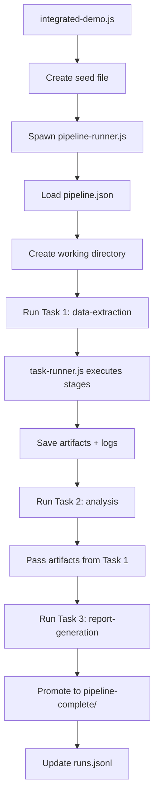

# 🚀 Prompt-Orchestration Pipeline Demo

A complete working demonstration of the Prompt-Orchestration Pipeline using mocked ChatGPT functions and the **full pipeline system**.

## Quick Start

### 1. Setup Demo Files

```bash
# Create all necessary files and directories
node setup-demo.js
```

### 2. Run the Demo

```bash
# Run with the full pipeline system (recommended)
npm run demo

# Run with orchestrator simulation
npm run demo:orchestrator

# Or run specific scenarios
npm run demo:ai        # AI market analysis
npm run demo:simple    # Simple EV analysis
npm run demo:list      # List available scenarios
```

### 3. View Results

Results are saved in:

- **Completed runs**: `pipeline-complete/<pipeline-id>/`
- **Failed runs**: `pipeline-current/<pipeline-id>/` (for debugging)
- **Run history**: `pipeline-complete/runs.jsonl`

## How It Works

### 🏗️ **Full Pipeline Architecture**

The demo now uses the **complete orchestration system**:

1. **integrated-demo.js** - Demo controller that creates seed files
2. **pipeline-runner.js** - Outer pipeline (process management, state tracking)
3. **task-runner.js** - Inner pipeline (task stage orchestration)
4. **Individual task modules** - Actual task implementations

### 🔄 **Execution Flow**



## What the Demo Shows

### 🎯 **Real Pipeline System Features**

**Process Isolation**: Each pipeline runs in its own process via `pipeline-runner.js`

**State Management**: Complete state tracking with atomic updates

- `tasks-status.json` tracks execution progress
- Working directories isolate runs
- Failed runs preserved for debugging

**Artifact Management**: Data flows between tasks automatically

- Task outputs become inputs for next stage
- Structured artifact passing with metadata
- Complete audit trail of transformations

**Error Recovery**: Production-ready error handling

- Failed tasks leave debugging information
- Retry logic with validation loops
- Graceful degradation and cleanup

**Pipeline Promotion**: Successful runs moved to `pipeline-complete/`

- Atomic directory rename on success
- Run history maintained in JSONL format
- Failed runs remain in `pipeline-current/` for inspection

### 🧪 **Mock ChatGPT Integration**

**Realistic API Simulation**:

- Model-specific response characteristics
- Token usage and cost estimation
- Confidence scoring for validation
- 5% random failure rate for testing resilience

**Intelligent Responses**:

- Context-aware responses based on prompt content
- Different response types (extraction, analysis, reports)
- Varying quality and length based on model selection

## Sample Output

```bash
🚀 Starting Full Pipeline System Demo
============================================================
This demo uses the complete orchestration system:
• orchestrator.js (process management)
• pipeline-runner.js (outer pipeline)
• task-runner.js (inner pipeline)
• Individual task modules
============================================================
📋 Demo Scenario: MARKET-RESEARCH
🎯 Industry: renewable-energy
🌍 Region: north-america
📅 Timeframe: 2024-2025
============================================================

📁 Created seed file: renewable-energy-1734567890123-seed.json
🔄 Triggering pipeline...

🚀 Spawning pipeline-runner.js...

📥 [Data Extraction] Starting ingestion...
⚙️ [Data Extraction] Pre-processing...
📝 [Data Extraction] Creating prompt...
🤖 [Data Extraction] Calling ChatGPT...
🔧 [Data Extraction] Parsing output...
✅ [Data Extraction] Validating structure...
🎯 [Data Extraction] Validating quality...
📦 [Data Extraction] Finalizing...

📥 [Analysis] Starting ingestion...
📝 [Analysis] Creating analysis prompt...
🤖 [Analysis] Generating analysis...
... (continues with full pipeline execution)

✅ Pipeline runner completed successfully!

📊 PIPELINE RESULTS
============================================================
✅ Pipeline Status: COMPLETED
📁 Results Location: pipeline-complete/renewable-energy-1734567890123
🆔 Pipeline ID: pl-2024-09-24-15-45-30-abc123
⏱️  Total Execution Time: 8.73s

📋 Task Execution Summary:
----------------------------------------
✅ data-extraction: done (1247ms)
✅ analysis: done (1456ms)
✅ report-generation: done (1834ms)

📦 Generated Artifacts:
----------------------------------------

📄 REPORT-GENERATION OUTPUT:
# North American Renewable Energy Market Report 2024-2025

## Executive Summary
The North American renewable energy sector continues robust expansion, with total installed capacity reaching 250 GW and market valuation of $180 billion...

📊 Report Stats:
   Word Count: 1847
   Report Type: executive-summary
   Model: gpt-4-turbo
   Confidence: 0.92
   Tokens: 2156
```

## Commands Reference

```bash
# Use the full pipeline system
npm run demo                    # Default renewable energy demo
npm run demo:ai                # AI market analysis
npm run demo:simple            # Simple EV analysis

# Simulate orchestrator file-watching
npm run demo:orchestrator      # Shows orchestrator workflow

# Utilities
npm run demo:list              # List available scenarios
node setup-demo.js             # Reset/setup demo environment
```

## Key Differences from Simple Demo

| Feature              | Simple Demo           | Integrated Demo         |
| -------------------- | --------------------- | ----------------------- |
| **Execution**        | Direct function calls | Spawned processes       |
| **State**            | In-memory only        | Persistent files        |
| **Isolation**        | Shared process        | Process isolation       |
| **Recovery**         | Basic error handling  | Full state preservation |
| **Artifacts**        | Memory passing        | File-based artifacts    |
| **Monitoring**       | Console output only   | Complete audit trail    |
| **Production Ready** | No                    | Yes                     |

This integrated demo showcases the full power of the Prompt-Orchestration Pipeline system as a production-ready framework for complex LLM workflows.
