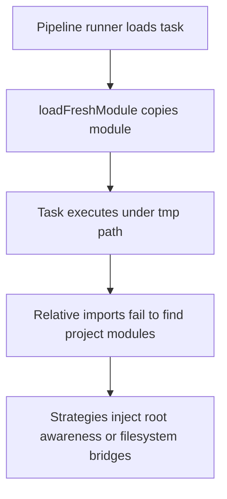

Assessment Summary  
Tasks like [`synthesis.js`](demo/pipeline-config/content-generation/tasks/synthesis.js:1) execute inside per-job working directories (`{PO_CURRENT_DIR}/{jobId}/tasks/{taskName}`) created by [`pipeline-runner.js`](src/core/pipeline-runner.js:90). When [`loadFreshModule()`](src/core/module-loader.js:114) cache-busts ESM imports, Node sometimes fails to resolve the original file URL and the loader copies the task into `.tmp-task-modules/…`. That relocation strips the task of its sibling files and any `node_modules` chain, so relative `import` specifiers and bare package specifiers resolve against the temporary folder instead of the repository tree.

Execution Constraints for Relocatable Tasks  
• Stage handlers are runtime-loaded via [`runPipeline()`](src/core/task-runner.js:375) and must work even when the physical file is copied away from its source directory.  
• Context must remain relocatable: the orchestrator copies seeds into job-specific `workDir`, and tasks may run in worker containers without the repo tree present.  
• Node’s standard resolution walks up from `import.meta.url` to find `node_modules`; once the module lives under `.tmp-task-modules`, there is no `node_modules` ancestor.  
• Tasks should keep zero setup assumptions beyond artifacts in `workDir`, so any dependency access must be injected or virtualized at runtime.

Resolution Options

1. Deterministic Root-Aware Module Loading  
   • Teach [`loadFreshModule()`](src/core/module-loader.js:114) to rewrite relative specifiers before doing the cache copy. The loader can inject a custom `import.meta.resolve` that treats `PO_ROOT` (set in [`spawnRunner()`](src/core/orchestrator.js:222)) as the base.  
   • Implementation steps:  
    – Parse the original module for relative specifiers before copying; expand them to absolute `file://` URLs anchored to the original path.  
    – Use `node:module`’s `register` or `Module.createRequire` with a virtual path rooted at `PO_ROOT` so bare specifiers fall back to the project’s `node_modules`.  
   • Pros: Transparent to task authors; no filesystem churn at runtime.  
   • Cons: Requires AST or regex rewriting; must keep in sync with ESM syntax; adds loader complexity.

2. Runtime Dependency Bridge via Symlinks  
   • At task setup, create symlinks inside `context.taskDir` that mirror project dependencies:  
    – `workDir/tasks/{taskName}/node_modules -> {PO_ROOT}/node_modules`  
    – `workDir/tasks/{taskName}/project -> {PO_ROOT}` for relative imports.  
   • Implementation steps:  
    – Extend [`pipeline-runner.js`](src/core/pipeline-runner.js:90) setup to create symlinks after `fs.mkdir(taskDir)`.  
    – Update cleanup logic to remove symlinks when archiving job directories.  
   • Pros: Simple, leverages native Node resolution, no code parsing.  
   • Cons: Requires filesystem permissions for symlinks; breaks on Windows without admin or with restricted filesystems; duplicates surface for sandboxed deployments.

3. Bundle Tasks with Explicit Dependency Manifests  
   • Introduce a build step that transpiles each task into a self-contained bundle (esbuild/tsup) before relocation.  
   • Implementation outline:  
    – Specify entry points in `pipeline-config/tasks/index.js`.  
    – Generate bundles under `dist/pipeline-tasks/{slug}/…` with external resolution pinned to absolute paths or embedded.  
    – Adjust [`TASK_REGISTRY`](src/core/pipeline-runner.js:45) to point to bundles when available.  
   • Pros: Guarantees deterministic artifacts, supports shipping tasks independently.  
   • Cons: Adds build pipeline complexity; bundle must be refreshed on every edit; debugging compiled output is harder.

4. Controlled Execution via Worker Harness  
   • Instead of copying modules, launch tasks inside a Node subprocess anchored at `PO_ROOT` with `--cwd={PO_ROOT}` and pass `workDir` via args/env.  
   • Implementation outline:  
    – Add a “task executor” CLI in repo root that `import`s the task from its original path, sets up `context`, and runs the stage.  
    – [`runPipeline()`](src/core/task-runner.js:375) would spawn this CLI per stage with IPC for `{ output, flags }`.  
   • Pros: Preserves true filesystem context, avoids loader hacks.  
   • Cons: Higher process overhead; IPC serialization needed; complicates logging and tracing.

Mermaid Overview

Recommended Next Steps

1. Decide between loader rewrite (Option 1) and symlink bridge (Option 2) based on deployment platform’s filesystem guarantees.
2. Prototype chosen approach in a feature flag branch, instrumenting resolution telemetry (success, fallback counts) through [`writeJobStatus()`](src/core/status-writer.js:159).
3. Add developer guidance to [`docs/task-development-guide.md`](docs/task-development-guide.md:1) covering the new dependency access pattern.
4. Create regression tests under `tests/pipeline-tasks.test.js` validating that tasks importing `node_modules` and local utilities succeed when copied.

If this plan looks good, I can request a mode switch to implement the selected option.
