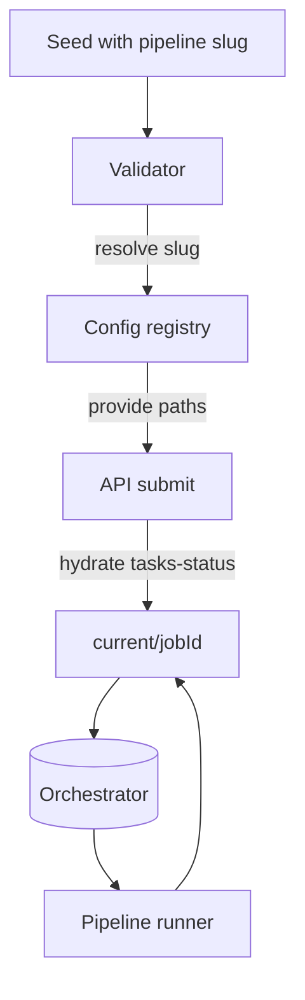

# Multi-pipeline Backend Plan (Revised)

## Overview

- Goal: enable named pipeline types without altering UI presentation.
- Backwards compatibility explicitly dropped; seeds must reference a pipeline slug.
- Filesystem layout under `pipeline-data/` remains a heterogeneous mix of jobs.

## Configuration Surface

1. **Explicit pipeline registry**
   - Extend config schema to include `pipelines` map keyed by slug with definition roots.
   - Example snippet:
     ```json
     {
       "pipelines": {
         "content-generation": {
           "configDir": "pipeline-config/content-generation",
           "tasksDir": "pipeline-config/content-generation/tasks"
         }
       }
     }
     ```
   - Remove assumptions about defaults; callers must supply `pipeline` explicitly.
   - Update loaders in [`src/core/config.js`](src/core/config.js:74) to:
     - Parse `pipelines` map.
     - Offer helper `getPipelineConfig(slug)` returning resolved paths.
     - Validate slug existence; error if missing.

2. **Pipeline configuration directories**
   - Restructure `pipeline-config/` so each pipeline type lives in a subfolder:
     ```
     pipeline-config/
       content-generation/
         pipeline.json
         tasks/
       data-processing/
         pipeline.json
         tasks/
     ```
   - CLI `init` should scaffold `pipeline-config/<slug>/` (see below).

## Seed Ingestion & Validation

1. **Seed shape changes**
   - Require `pipeline` field in seeds.
   - Update Ajv schema in [`src/core/validation.js`](src/core/validation.js:7) to include `pipeline` (enum derived from loaded config).
   - Enforce presence in lightweight validator [`src/api/validators/seed.js`](src/api/validators/seed.js:96); replace default fallback with explicit existence check.

2. **Duplicate handling**
   - Continue leveraging job `name` uniqueness, but scoping can remain global because job directories already use UUIDs.
   - Validate job name collisions against pending/current/complete as before.

3. **Snapshotting**
   - When writing job metadata (`seed.json`, `pipeline.json`, `tasks-status.json`) keep existing paths under `pipeline-data/<state>/<jobId>/`.
   - Ensure `pipeline.json` snapshot uses definition retrieved from selected slug (no structure change in `pipeline-data/`).

## CLI and API Changes

1. **CLI submit**
   - Require `--pipeline <slug>` or auto-read from seed payload.
   - Validate slug using new config helper prior to calling `submitJobWithValidation` ([`src/cli/index.js`](src/cli/index.js:69)).

2. **CLI init**
   - Accept `--pipeline-slug` argument.
   - Generate `pipeline-config/<slug>/pipeline.json` plus task registry skeleton ([`src/cli/index.js`](src/cli/index.js:16)).

3. **API submit flow**
   - Use `getPipelineConfig(slug)` to resolve definition/task registry.
   - Write seed into `pipeline-data/pending/` as today (no additional nesting).
   - Populate `tasks-status.json` and `tasks/` from the selected pipeline definition before orchestrator picks up the job ([`src/api/index.js`](src/api/index.js:147)).

## Orchestrator & Runner

1. **Orchestrator**
   - Minimal change: when moving seed into `current/<jobId>/`, use slug to copy appropriate template.
   - Include pipeline slug in status metadata (already stored as `pipelineName`, ensure value comes from seed).
   - No change to watcher locations or directory layout ([`src/core/orchestrator.js`](src/core/orchestrator.js:65)).

2. **Runner**
   - Accept pipeline slug via env/argv (seed metadata already accessible).
   - Resolve config/task registry by slug when loading modules ([`src/core/pipeline-runner.js`](src/core/pipeline-runner.js:8)).
   - No structural change to workDir; still `pipeline-data/current/<jobId>/`.

3. **Task runner**
   - No change required; it consumes task registry paths and status context ([`src/core/task-runner.js`](src/core/task-runner.js:73)).

## Testing & Tooling

- Update fixtures to use `pipeline-config/<slug>/`.
- Adjust helper [`tests/utils/createTempPipelineDir.js`](tests/utils/createTempPipelineDir.js:13) only as needed to place stub definitions per slug; no per-pipeline data-tree branching.
- Expand tests:
  - Seed validators covering missing/invalid `pipeline`.
  - End-to-end submission ensuring chosen slug drives pipeline snapshot.
  - Orchestrator test verifying task registry selection per job.
- CLI integration tests for `init --pipeline-slug` and `submit --pipeline`.

## Migration Considerations

- Provide script to move existing single `pipeline-config/` into `pipeline-config/default/` for adopters.
- Document requirement to update seeds with `pipeline` field.



## Implementation Roadmap (multi-PR)

1. **PR 1 – Pipeline registry foundation**
   - Restructure `pipeline-config/` into slug-named subfolders and migrate demo assets.
   - Extend configuration schema/loader in [`src/core/config.js`](src/core/config.js:74) to expose a `pipelines` map, add `getPipelineConfig(slug)`, and remove fallback defaults.
   - Update developer docs to describe the new directory convention and required seed `pipeline` field.

2. **PR 2 – Seed schema, validation, and CLI alignment**
   - Require `pipeline` in AJV schema via [`src/core/validation.js`](src/core/validation.js:7) and enforce existence in [`src/api/validators/seed.js`](src/api/validators/seed.js:96).
   - Adjust CLI: `init --pipeline-slug` scaffolds `pipeline-config/<slug>/`, and `submit --pipeline` validates slugs before calling the API ([`src/cli/index.js`](src/cli/index.js:16)).
   - Refresh CLI tests and docs to reflect mandatory slugs.

3. **PR 3 – API submission and orchestrator wiring**
   - Use `getPipelineConfig(slug)` inside [`src/api/index.js`](src/api/index.js:147) to hydrate `tasks-status.json`, `tasks/`, and metadata from the selected pipeline before the orchestrator processes the job.
   - Ensure orchestrator seed handling preserves the slug in status/state without altering watcher layout ([`src/core/orchestrator.js`](src/core/orchestrator.js:65)).

4. **PR 4 – Runner resolution and integration coverage (Revised)**
   - **Propagate slug into runner process**: In [`src/core/orchestrator.js`](src/core/orchestrator.js:221), pass `PO_PIPELINE_SLUG` (sourced from the job's `seed.pipeline`) into the child process environment inside `spawnRunner`. Remove legacy fallbacks (`PO_PIPELINE_PATH`, `PO_TASK_REGISTRY`) once slug propagation is confirmed.
   - **Resolve pipeline assets at runtime**: Update [`src/core/pipeline-runner.js`](src/core/pipeline-runner.js:1) to read `process.env.PO_PIPELINE_SLUG`; if absent, read `seed.json` in `workDir` and extract `pipeline`. Use `getPipelineConfig(slug)` to derive `pipelineJsonPath` and `tasksDir`, replacing existing static path calculations.
   - **Remove residual default helpers**: Delete `getDefaultPipelineConfig` exports and replace any imports in orchestrator, runner, and UI config bridge. Confirm all consumers rely on explicit slugs or job metadata.
   - **Streamline UI config bridge**: Remove functions in [`src/ui/config-bridge.js`](src/ui/config-bridge.js:97) that attempted to return "pathway" details. Narrow the bridge to only expose filesystem roots needed for UI without pipeline-specific metadata.
   - **Verify job metadata slug propagation**: Ensure `job.json` and `tasks-status.json` generated during submission include the `pipeline` slug. Add writes in [`src/api/index.js`](src/api/index.js:147) if missing.
   - **Integration test updates**: Expand [`tests/pipeline-runner.test.js`](tests/pipeline-runner.test.js:1) with cases covering multiple slugs and verifying runner loads slug-specific tasks. Add orchestration coverage in [`tests/orchestrator.test.js`](tests/orchestrator.test.js:1) to assert `PO_PIPELINE_SLUG` is set when spawning the runner. Adjust [`tests/config-bridge.test.js`](tests/config-bridge.test.js:1) to reflect the slimmed-down bridge.
   - **Fixture enhancements**: Extend [`tests/utils/createTempPipelineDir.js`](tests/utils/createTempPipelineDir.js:1) to scaffold multiple pipeline config directories so tests can swap slugs. Provide minimal pipeline definitions and task registries per slug for runner/orchestrator tests.
   - **Documentation**: Update this plan to reference the revised PR4 scope. Add notes to developer docs indicating that pipeline slug resolution occurs through job metadata and `getPipelineConfig(slug)`.
   - **Regression checklist**: Run targeted suites: `npm test -- pipeline-runner orchestrator config-bridge`. Execute manual end-to-end run with two distinct slugs to confirm proper task registry selection.
