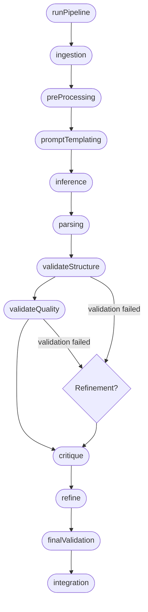

# Task Runner Document Plan

## Document Goal

- Provide a structured Markdown document that explains which task-stage functions are invoked by `runPipeline`, in what sequence, and with what contextual inputs and expected outputs.
- All observations must stay within the evidence available in [src/core/task-runner.js:8-261].
- Highlight refinement and error-handling behaviors that affect stage invocation.

## Source File

- Canonical reference: [src/core/task-runner.js:8-261]

## Key Behavioral Observations to Capture

- The canonical stage order is fixed by the `ORDER` array.
- Stage functions are looked up from the loaded task module (either default export or module namespace).
- Each stage receives a shared `context` object, which is mutated over time and enriched with stage results.
- Stage return values that are objects are merged into `context` via `Object.assign`.
- `context.currentStage` is updated before each invocation, enabling downstream consumers (e.g., `fileIO`, logging).
- Optional `fileIO` singleton is instantiated when `initialContext` provides `workDir`, `taskName`, and `statusPath`.
- LLM usage is monitored via event listeners that annotate metrics with stage metadata.
- A refinement loop replays validation, critique, and refine stages under specific conditions.

## Planned Document Structure

1. **Introduction**
   - Purpose of the document.
   - Brief description of `runPipeline` and its scope.

2. **Pipeline Initialization**
   - Environment loading (`loadEnvironment`) and LLM creation (`createLLM`), including default provider resolution.
   - Configuration access (`getConfig`) and `maxRefinementAttempts`.
   - `fileIO` creation prerequisites and how `context.io` is set.

3. **Context Object Overview**
   - Initial fields and dynamic properties (`currentStage`, `llm`, `io`, `validationFailed`, `lastValidationError`, `refined`, etc.).
   - Mutation pattern when stages return objects.

4. **Stage Execution Overview**
   - Narrative summary plus an ordered list/table covering:
     - Stage name.
     - Invocation prerequisites.
     - Inputs (relevant context properties or resources).
     - Outputs or expected side effects on `context`.
     - Skip scenarios (undefined function, refinement cycle rules, pre-refinement shortcuts).

5. **Per-Stage Details**
   - Dedicated subsection for each stage in `ORDER`.
   - Include sub-bullets for:
     - Timing of invocation within the loop.
     - Special behaviors observed in code (e.g., `validateStructure` triggering refinement).
     - Interaction with refinement cycles.
     - Relationship with logging and metrics.

6. **Refinement Cycle Mechanics**
   - Conditions that set `needsRefinement`.
   - Pre-validation critique/refine execution path when `refinementCount > 0` and `context.refined` is falsy.
   - How refinement cycles are counted and capped (`maxRefinementAttempts`).
   - Handling of skipped stages during refinement.

7. **Error Handling and Termination**
   - Distinctions between validation-triggered retries and hard failures.
   - Final failure response structure (`ok: false`, `failedStage`, `error`, `logs`, `context`, `refinementAttempts`).
   - Success response structure (`ok: true`, `logs`, `context`, `refinementAttempts`, `llmMetrics`).
   - Post-run cleanup of LLM event listeners.

8. **`runPipelineWithModelRouting` Supplement**
   - How it seeds `context` with model routing data before delegating to `runPipeline`.
   - Default values for `availableModels` and `currentModel`.

9. **Appendix**
   - Description of logged entries (`stage`, `ok`, `ms`, `reason`, `refinementCycle`, error info).
   - Optional schema sketch for `llmMetrics`.

## Stage Detail Notes for Reference

### ingestion

- First stage in the canonical order.
- Invoked only on the initial pass (skipped during refinement cycles).
- Receives `context` with `currentStage` set to `"ingestion"` and any previously accumulated data.
- Expected to enrich `context` by returning an object (e.g., raw inputs, file handles), though actual content is task-defined.
- Logging records success or skip depending on presence of the function.

### preProcessing

- Second in order; similarly skipped on refinement cycles (`refinementCount > 0`).
- Shares the same input pattern as `ingestion` (the evolving `context`).
- Can prepare data for downstream templating/inference steps.

### promptTemplating

- Runs after preprocessing every cycle (unless undefined).
- No special skip logic besides missing function detection.
- Outputs presumed to include rendered prompts or template metadata.

### inference

- Triggered after templating; likely performs LLM calls using `context.llm`.
- Logs duration and success/failure; errors propagate as immediate failures.

### parsing

- Consumes inference outputs from `context`.
- Failures bubble and abort the pipeline.
- Successes can add structured data to `context`.

### validateStructure

- Ensures structural correctness.
- On success:
  - If `context.validationFailed` is truthy and refinement attempts remain, triggers refinement.
- On error:
  - Captures error info, may set `context.lastValidationError`, and can initiate refinement (if attempts remain).
- During refinement cycles, may be preceded by auto-invoked `critique` and `refine` if `context.refined` is falsy.

### validateQuality

- Mirrors `validateStructure` for qualitative checks.
- Shares refinement trigger logic and pre-validation behavior.

### critique

- Normally runs once per pass if defined.
- During refinement loops, it may run _before_ validation as part of the pre-refinement hook.
- Skipped when already executed in the same cycle due to pre-refinement.

### refine

- Works with `critique` to address validation issues.
- Merged outputs can set `context.refined = true` to signal successful refinement.
- Skipped if already executed in pre-refinement for the current cycle.

### finalValidation

- Executes after refinement loops conclude.
- No additional logic beyond standard invocation and context merge.

### integration

- Final stage in `ORDER`; integrates or persists final outputs.
- Runs once per pipeline pass if defined.

## Logging and Metrics Coverage in the Document

- Describe log entry shape and how skipped stages are annotated with reasons.
- Note `llmMetrics` collection via `llm:request:complete` and `llm:request:error` events, including augmentation with `task` and `stage`.

## Planned Visuals

- The final document will embed this flowchart (or a refined version) to illustrate stage order and refinement loops.

## Next Steps (for Implementation Mode)

1. Draft the Markdown document following the outlined structure.
2. Populate each section using direct evidence from [src/core/task-runner.js:8-261].
3. Compose stage summaries and tables, ensuring all context mutations and skip conditions are explicitly documented.
4. Insert the Mermaid diagram and verify rendering constraints (no disallowed characters in node labels).
5. Review for fidelity to the source file and absence of unstated assumptions.
