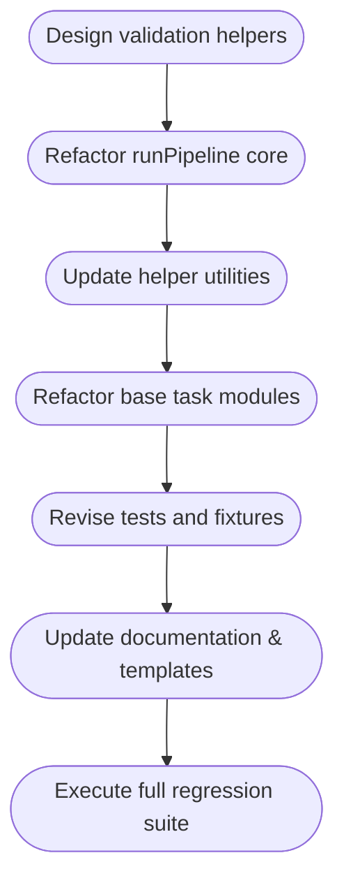

# Task Runner Refactor Plan (No Backwards Compatibility)

**Scope:** Redesign the task pipeline around immutable stage inputs and structured outputs, based solely on the current behavior defined in [`src/core/task-runner.js:8-261`](src/core/task-runner.js:8). This plan assumes we can break existing task contracts and demo modules.

---

## 1. Objectives

1. Restructure `context` to centralize pipeline data under `context.data` with the seed available at `context.data.seed`.
2. Ensure every stage handler operates on cloned `data` and `flags`, returning an object `{ output, flags }`.
3. Store each stage’s return under `context.data.<stage>` and merge returned `flags` into `context.flags`.
4. Enforce runtime validation for handler return shapes and flag typing, including contextual checks for required flags.
5. Update supporting utilities, documentation, and tests to reflect the new contract.

---

## 2. Target Context Model

| Component              | Description                                                                                                          |
| ---------------------- | -------------------------------------------------------------------------------------------------------------------- |
| `context.meta`         | Stable metadata (e.g., `taskName`, `workDir`, `statusPath`, configuration, `llm`, `io`).                             |
| `context.data`         | Mutable pipeline data bag. Initial shape: `{ seed: <seedPayload> }`. Each stage populates `context.data[stageName]`. |
| `context.flags`        | Mutable control-state dictionary shared across stages (e.g., `validationFailed`, `refined`).                         |
| `context.logs`         | Retains existing log entries; augmented with validation results per stage.                                           |
| `context.currentStage` | Tracks the executing stage for metrics/logging.                                                                      |

### Initialization Steps

1. Normalize incoming `initialContext` by extracting:
   - `seed` ⇒ stored at `context.data.seed`.
   - Other primitive or object payloads as `context.meta`.
2. Initialize `context.flags` to an empty object unless provided (future migrations can populate defaults via metadata).
3. Maintain existing singleton setup (`createTaskFileIO`, `createLLM`) but expose them through `context.meta`.

---

## 3. Stage Execution Contract

### 3.1 Invocation Flow

1. Before each stage:
   - `const stageData = structuredClone(context.data);`
   - `const stageFlags = structuredClone(context.flags);`
   - Assemble `stageContext = { ...context.meta, data: stageData, flags: stageFlags, currentStage }`.
2. Validate prerequisite flags:
   - Each stage declares `expectedFlags` metadata (see Section 4.3).
   - Runner verifies that required flags exist in `context.flags` with the declared shape before invoking the handler.

### 3.2 Handler Requirements

- Signature: `async function stage(stageContext)`.
- Must return an object `{ output, flags }`.
  - `output`: any serializable payload; typically stage-specific result.
  - `flags`: an object containing control state mutations (e.g., `{ validationFailed: true }`). Must be a plain object (no arrays, primitives, or null).
- Throwing an error triggers failure handling identical to current behavior.

### 3.3 Post-Execution Merge

1. Validate response shape:
   - Non-null object.
   - Has own properties `output` and `flags`.
   - `flags` is a plain object. (Use lightweight structural assertion.)
2. Persist results:
   - `context.data[stage] = result.output`.
   - `context.flags = { ...context.flags, ...result.flags }` (shallow merge; Section 4.4 introduces type guards).
3. Log entry includes `outputType = typeof result.output` and `flagKeys = Object.keys(result.flags)` for auditing.

---

## 4. Validation and Metadata Strategy

### 4.1 Return Shape Validation

- Introduce helper `assertStageResult(stage, result)` to enforce:
  - Type checks (object, has `output`, has `flags`).
  - `flags` passes `isPlainObject`.
  - Optional: deep cloning of returned data if we need to prevent aliasing (configurable).

### 4.2 Flag Type Registry

- Maintain a registry mapping stages to expected flag schemas, e.g.:

```js
const FLAG_SCHEMAS = {
  validateStructure: {
    validationFailed: "boolean",
    lastValidationError: ["string", "object", "undefined"],
  },
  refine: {
    refined: "boolean",
  },
};
```

- The runner checks, before stage execution, that `context.flags` contains expected keys with allowed types (if marked as required). Missing or mismatched types raise a configuration error.

### 4.3 Stage Metadata Declaration

- Each task module exports metadata alongside handlers, e.g.:

```js
export const meta = {
  validateStructure: {
    expectedFlags: {
      refined: { required: false, types: ["boolean"] },
    },
  },
};
```

- `runPipeline` reads metadata (default empty objects) to enforce pre- and post-conditions.
- Metadata also enables per-stage configuration like max retries or cloning options.

### 4.4 Flag Merge Semantics

- Shallow merge is acceptable initially; detect conflicting types by comparing existing type vs. new type and throw if mismatch.
- Optionally support namespacing: allow stages to return nested flags (e.g., `{ validation: { structure: "passed" } }`) with standardized merge logic (deep merge with type check).

---

## 5. Core Refactor Steps

### 5.1 Pipeline Core

1. Rewrite `runPipeline` to:
   - Build new `context` structure (Section 2).
   - Clone `data` and `flags` per stage.
   - Invoke `assertStageResult`.
   - Store outputs and merge flags as described.
   - Replace `Object.assign(context, result)` with targeted assignments.
   - Adjust refinement logic to consume `context.flags` (e.g., `context.flags.validationFailed`) instead of top-level properties.

2. Update refinement checks:
   - Replace direct `context.validationFailed` usage with `context.flags.validationFailed`.
   - Ensure any omission of `validationFailed` defaults to `false`.

3. Adjust pre-refinement invocation:
   - `context.flags.refined` determines whether to skip pre-refine.
   - Stage metadata should mark `critique` and `refine` outputs accordingly.

4. Update success and failure payloads to expose `context.data` and `context.flags` instead of the old flattened context. Consider exporting a compatibility helper to project-level API if needed.

### 5.2 Helper Utilities

- `createTaskFileIO` should now attach under `context.meta.io`.
- Update metric capture to read `context.meta.taskName`.
- Provide `buildStageContext(meta, data, flags)` utility for clarity and future reuse.

### 5.3 Task Modules

- Rewrite demo and internal tasks to conform:
  - Replace direct `context.output` reads with `context.data` clones passed into handlers.
  - Return `{ output, flags }` explicitly.
  - Set flag values instead of mutating `context` directly (`flags.validationFailed = true`).
- Provide scaffolding or codemods to aid mass migration (optional but useful).

---

## 6. Testing Strategy

1. **Unit Tests**
   - `runPipeline` happy path verifying data storage under `context.data.<stage>` and flag merges.
   - Error cases: handlers returning invalid shapes, flags with wrong types, missing flags when required.
   - Refinement loop using new flag structure (simulate validate failure/ success).
   - Cloning verification: ensure stage mutations do not leak back into `context.data` before merge.

2. **Integration Tests**
   - Update `tests/task-runner.test.js` to use new contract.
   - Align pipeline demo tests (`tests/task-file-endpoints.test.js`, `tests/pipeline-runner.test.js`, etc.) with restructured context payload.
   - Add tests for stage metadata-driven flag validation.

3. **Static Validation**
   - ESLint/TypeScript (if added) rules or custom lints ensuring handlers export `{ output, flags }`.

---

## 7. Documentation & Tooling Deliverables

- Update task author guides (create new section referencing `context.data` and `context.flags` usage).
- Provide migration doc summarizing new stage contracts.
- Update CLI/README references to new result payload structure.
- Offer template or generator for new task modules.

---

## 8. Execution Sequence



---

## 9. Open Questions (to resolve during implementation)

1. **Cloning Strategy:** `structuredClone` vs. custom deep clone for environments lacking support. Consider polyfill or utility.
2. **Flag Schema Definition:** Where to store stage metadata (same module vs. central registry). Design to avoid circular imports.
3. **Metrics/Logging Adjustments:** Decide whether logs should reference `context.data.<stage>` snapshots or just metadata.
4. **Result Payload Shape:** Determine whether API consumers require both `context.data` and aggregated `flags`, or if additional derived fields are necessary.

---

## 10. Next Steps

1. Approve the proposed contract and validation framework.
2. Finalize stage metadata schema and cloning approach.
3. Proceed with implementation in Code mode following the execution sequence.
