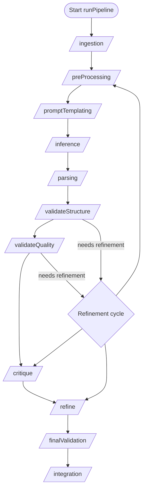

# Task Runner Stage Reference

## 1. Purpose and Scope

This document describes the task-stage execution flow implemented by [`runPipeline()`](src/core/task-runner.js:26). It explains which stage functions may execute, the order in which they are considered, what contextual data they consume, and how their outputs influence subsequent processing.

## 2. Primary Sources

- [`runPipeline()`](src/core/task-runner.js:26)
- [`runPipelineWithModelRouting()`](src/core/task-runner.js:264)
- Helper utilities [`toAbsFileURL()`](src/core/task-runner.js:278) and [`normalizeError()`](src/core/task-runner.js:288)

## 3. Pipeline Initialization

### 3.1 Environment and LLM Setup

1. If `initialContext.envLoaded` is falsy, [`loadEnvironment()`](src/core/task-runner.js:28) runs and the flag is set to `true`.
2. If `initialContext.llm` is missing, a model client is created via [`createLLM()`](src/core/task-runner.js:33) with `defaultProvider` resolved from:
   - `initialContext.modelConfig?.defaultProvider`
   - `process.env.PO_DEFAULT_PROVIDER`
   - Fallback `"openai"`

### 3.2 Configuration and Metrics

- [`getConfig()`](src/core/task-runner.js:41) supplies `config.taskRunner.maxRefinementAttempts`.
- An array `llmMetrics` captures events emitted via [`getLLMEvents()`](src/core/task-runner.js:43). Each recorded metric is augmented with the active `context.meta.taskName` and `context.currentStage`.
- Event listeners: `"llm:request:complete"` and `"llm:request:error"` (the latter marks entries with `failed: true`).

### 3.3 Task Module Loading

- The task module is located using [`toAbsFileURL()`](src/core/task-runner.js:58) and imported with cache busting (`?t=${Date.now()}`).
- Stage handlers are sourced from `mod.default ?? mod`.

### 3.4 File IO Singleton

- If `initialContext` provides `workDir`, `taskName`, and `statusPath`, [`createTaskFileIO()`](src/core/task-runner.js:71) constructs `context.io`.
- The `fileIO` accessor receives `getStage: () => context.currentStage`.

### 3.5 Context Object

`context` starts with the modern structure including `meta`, `data`, `flags`, `logs`, `io`, and `llm` sections. As stages execute:

- `currentStage` tracks the active stage.
- Stage results are stored in `context.data[stageName]`.
- Control flags are merged into `context.flags`.
- Validation state is managed through `context.flags.validationFailed` and related flags.

## 4. Canonical Stage Order

The fixed stage sequence is defined by [`PIPELINE_STAGES`](src/core/task-runner.js):

1. ingestion
2. preProcessing
3. promptTemplating
4. inference
5. parsing
6. validateStructure
7. validateQuality
8. critique
9. refine
10. finalValidation
11. integration

Each loop iteration sets `context.currentStage` before attempting the stage handler. Stages are optional and skipped cleanly if their handlers are not implemented.

## 5. Stage Execution Summary

| Stage             | Handler Required | Inputs from Context                             | Output Handling                          | Skip Conditions                                                                                               |
| ----------------- | ---------------- | ----------------------------------------------- | ---------------------------------------- | ------------------------------------------------------------------------------------------------------------- |
| ingestion         | Optional         | `context.output` (from seed) + shared resources | `{ output, flags }` merged into context  | No handler or refinement cycle (`refinementCount > 0`)                                                        |
| preProcessing     | Optional         | Same as ingestion                               | `{ output, flags }` merged into context  | No handler or refinement cycle                                                                                |
| promptTemplating  | Optional         | `context.output` + prior stage data             | `{ output, flags }` merged into context  | No handler                                                                                                    |
| inference         | Optional         | `context.llm` + prior data                      | `{ output, flags }` merged into context  | No handler; errors abort pipeline immediately                                                                 |
| parsing           | Optional         | `context` (consumes inference outputs)          | `{ output, flags }` merged into context  | No handler; failures abort pipeline                                                                           |
| validateStructure | Optional         | `context` + parsing results                     | May set `context.flags.validationFailed` | No handler; may trigger refinement                                                                            |
| validateQuality   | Optional         | Same input pattern as validateStructure         | Same as validateStructure                | No handler; may trigger refinement                                                                            |
| critique          | Optional         | `context`                                       | `{ output, flags }` merged into context  | No handler or skipIf predicate (`flags.validationFailed === false`); may run pre-validation during refinement |
| refine            | Optional         | `context` (potentially enriched by critique)    | `{ output, flags }` merged into context  | No handler or skipIf predicate; may run pre-validation during refinement                                      |
| finalValidation   | Optional         | Final context state                             | `{ output, flags }` merged into context  | No handler                                                                                                    |
| integration       | Optional         | Final context state                             | `{ output, flags }` merged into context  | No handler                                                                                                    |

### Notes:

- Stage handlers must return `{ output, flags }` objects conforming to the contract enforced by `assertStageResult()`.
- Flag types are validated against `FLAG_SCHEMAS` to ensure consistency.
- Stage duration is measured with `performance.now()` and logged.
- Console output is captured per stage for debugging purposes.

## 6. Refinement Cycle Mechanics

1. The main loop is wrapped in a `do ... while` that repeats when `needsRefinement` is set ([`src/core/task-runner.js:89-235`](src/core/task-runner.js:89)).
2. When `refinementCount > 0`, `ingestion` and `preProcessing` are automatically skipped ([`src/core/task-runner.js:101-112`](src/core/task-runner.js:101)).
3. Before `validateStructure` or `validateQuality` in refinement cycles, if `context.flags.refined` is falsy and no pre-refinement has occurred, the runner invokes `critique` and `refine` immediately ([`src/core/task-runner.js:114-164`](src/core/task-runner.js:114)).
4. After pre-refinement, the normal pass over `critique` or `refine` logs a skip reason (`"already-pre-refined"`) ([`src/core/task-runner.js:166-174`](src/core/task-runner.js:166)).
5. If a validation stage sets `context.flags.validationFailed` and `refinementCount < maxRefinements`, `needsRefinement` becomes `true` and the loop breaks to start another cycle ([`src/core/task-runner.js:185-193`](src/core/task-runner.js:185)).
6. Validation errors captured in `normalizeError()` are stored as `context.flags.lastValidationError` when retries remain ([`src/core/task-runner.js:205-211`](src/core/task-runner.js:205)).
7. Each refinement cycle increments `refinementCount` and logs a `refinement-trigger` entry with the reason (`"validation-error"` or `"validation-failed-flag"`) ([`src/core/task-runner.js:225-234`](src/core/task-runner.js:225)).

The loop terminates when either:

- No further refinements are needed, or
- `refinementCount` exceeds `maxRefinements`.

## 7. Error Handling and Termination

### 7.1 Stage Failures

- On any thrown error during a stage, the error is normalized and logged; the pipeline returns `{ ok: false, failedStage, error, logs, context, refinementAttempts }` ([`src/core/task-runner.js:194-221`](src/core/task-runner.js:194)).
- For validation stages, errors may trigger refinement if attempts remain.

### 7.2 Final Validation Failure

- If `context.flags.validationFailed` remains truthy after all attempts and at least one validation handler existed, the pipeline returns a failure summary with `failedStage: "final-validation"` ([`src/core/task-runner.js:238-250`](src/core/task-runner.js:238)).

### 7.3 Success Path

- On success, event listeners are removed and the function returns `{ ok: true, logs, context, refinementAttempts, llmMetrics }` ([`src/core/task-runner.js:252-261`](src/core/task-runner.js:252)).

## 8. Logging and Metrics Shapes

### 8.1 Log Entries

Each stage interaction pushes a log object containing:

- `stage`
- `ok` or `skipped`
- `ms` (duration) when executed
- `reason` for skips (e.g., `"refinement-cycle"`, `"already-pre-refined"`)
- `refinementCycle`
- `error` (normalized structure) on failure

### 8.2 LLM Metrics

- Successful requests add metrics annotated with `task` and `stage` ([`src/core/task-runner.js:45-51`](src/core/task-runner.js:45)).
- Errors are recorded with `failed: true` ([`src/core/task-runner.js:54-56`](src/core/task-runner.js:54)).

## 9. `runPipelineWithModelRouting()`

[`runPipelineWithModelRouting()`](src/core/task-runner.js:264) prepares a context extension:

- `modelConfig` copy
- `availableModels` defaulting to `modelConfig.models` or `["default"]`
- `currentModel` defaulting to `modelConfig.defaultModel` or `"default"`

It forwards the augmented context into [`runPipeline()`](src/core/task-runner.js:275).

## 10. Execution Flow Diagram



_Note: Nodes represent potential handler invocations. Skips and early exits are driven by the control flow described above._

## 11. Result Payload Structures

### 11.1 Success

```json
{
  "ok": true,
  "logs": [...],
  "context": { ... },
  "refinementAttempts": <number>,
  "llmMetrics": [...]
}
```

(Structure inferred from the return statement at [`src/core/task-runner.js:255-261`](src/core/task-runner.js:255).)

### 11.2 Failure

```json
{
  "ok": false,
  "failedStage": "<stage-name>",
  "error": { "name": "...", "message": "...", "stack": "..." },
  "logs": [...],
  "context": { ... },
  "refinementAttempts": <number>
}
```

(Structure inferred from failure paths at [`src/core/task-runner.js:214-221`](src/core/task-runner.js:214) and [`src/core/task-runner.js:243-250`](src/core/task-runner.js:243).)

## 12. Key Takeaways

- Stage invocation strictly follows the canonical order, with clean skips for missing handlers.
- Stages are chained via the last successful stage output; validation stages are excluded from chaining.
- All stage handlers must conform to the `{ output, flags }` contract with type validation.
- Validation stages control refinement loops, optionally invoking critique and refine ahead of validation during retries.
- The pipeline is designed for flexibility with optional stages and robust error handling.
